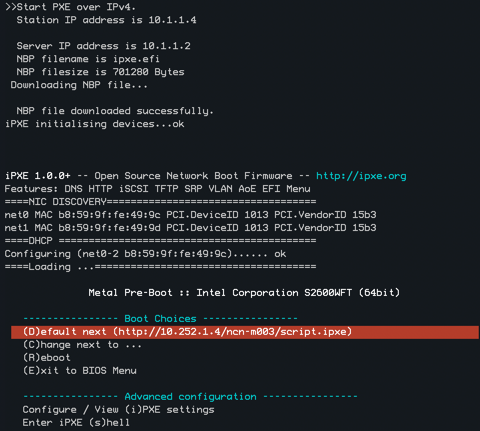

# Metal iPXE

This repository builds the iPXE binaries for Shasta, specifically for
booting non-compute nodes over the network.

### Binary

The provided cray-metal-ipxe RPM will install the compiled `ipxe.efi` files
into `/var/www/boot`. These will be owned by the UID of `dnsmasq`, and the
GID of `tftp`. 

### Source

This is built from original iPXE source code: https://github.com/ipxe/ipxe

### Signing / SecureBoot

The iPXE binary is unsigned, causing SecureBoot to fail where it is enabled and with working TPMs.

### Default Boot Script

The default boot script has a lot of options, most options can be found in various portions of
the dracut cmdline reference:

- [`rd.live.*` Booting Live Images](https://manpages.debian.org/testing/dracut-core/dracut.cmdline.7.en.html#Booting_live_images)
- [`ip=,ifname=` Network](https://www.man7.org/linux/man-pages/man7/dracut.cmdline.7.html#Network)

The NCN paramters should not be touched except for debug, they are tuned for booting NCNs for both
shasta 1.3 transitions to 1.4, and 1.4 on-wards. For concerns, please reach out to the repo owners.

### iPXE Menu

The `script.ipxe` file will dislay a menu on a node that offers some debugging abilities.

#### Example

#### Options Explained

- `Append Kernel Parameters` : adds `rd.cmdline=ask` to the kernel parameters, and prompts the user for more options to append.
- `Configure Settings` : allows reconfiuration of the iPXE binary itself on-the-fly.
- `Exit to BIOS` : dumps you to the system BIOS.
- `Reboot` : reboots the node
- `Enter iPXE Shell` : opens an iPXE command line, type exit to return to the menu
- `Boot HPC Node` : will start linux

### Contributing Guide

Any change to the built binaries warrants an increase in `.version`'s value.
